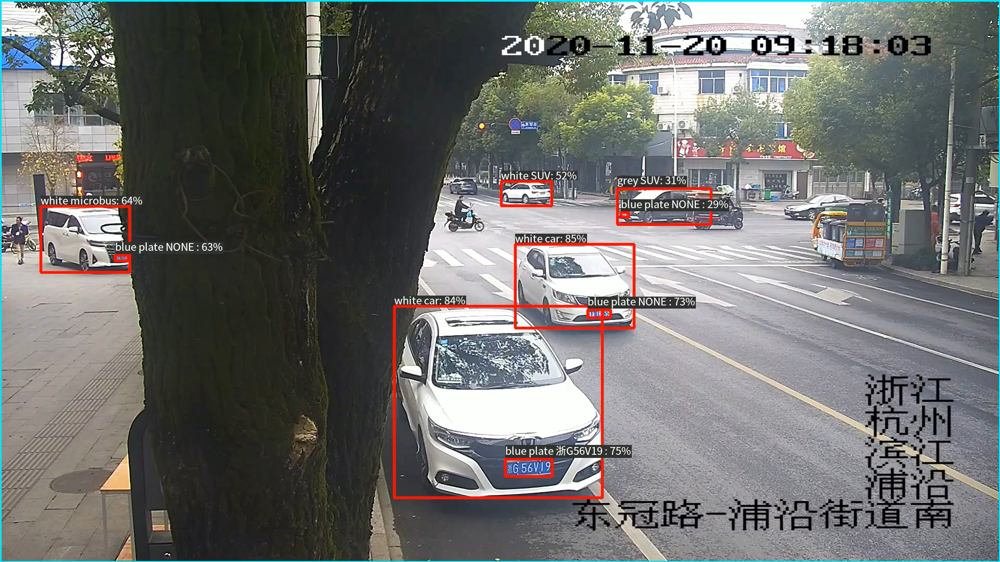
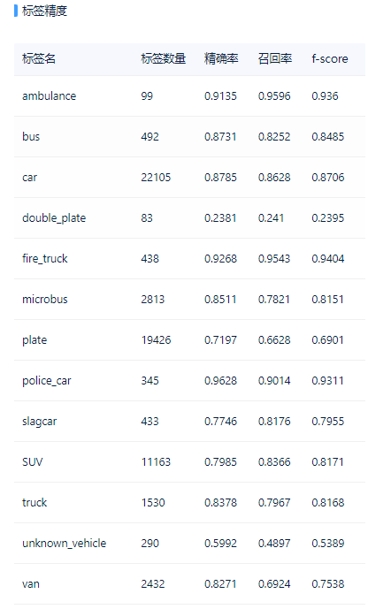

# 1、简介
本项目解决机动车违停问题，通过视觉检测出车辆类型、车辆颜色、车牌类型、车牌颜色、车牌内容，根据这些车辆结构信息判断是否违停。效果如下图所示：
  

使用yolov5检测 + paddleOCR识别,其中对yolov5进行修改，改为直接预测目标信息+颜色信息。  

测试结果视频为：[百度云盘](https://pan.baidu.com/s/17URoU3ZHEC1o1oDwXvdvtQ) ，提取码：zal2

**性能：**  
由于本项目参加了ECV2022比赛，使用的数据集没有公开，只能在比赛官方平台进行训练、调优，由于时间紧并未过多调优，所以模型结果并非最优。   
- 图片像素：1920*1080
- 数据集：19000+(比赛官方提供，非公开)
- 13类目标类别 + 10类颜色
- 模型-fscore: 80% 
- 实战-alert_accuracy: 97.57%
- 推理速度：15ms-25ms, 包含读取图片、图片预处理、检测+ocr识别、结果逻辑判断、画出结果图并保存的全部时间。

 
  
# 2、具体内容
## 2.1 yolov5_det/
用于检测车型、车牌（包括坐标位置和类别）、车辆/车牌颜色。  
由于一般检测输出 xywh+cls+conf, 如果想一次性训练预测目标和颜色，需要对输出进行修改。
将所有关于原来输出为 xywh+conf+num_cls的地方，均改为xywh+conf+num_cls+num_color.  
(搜索有“nco”的地方，一般为需要修改的地方，“nco”=num_color)  

yolov5_det/data/：对应的配置文件 
yolov5_det/models/yolo.py: **Detect类、parse_model、Model __init__**  
yolov5_det/utils/loss.py、general.py dataloaders等: NMS、画图plot等部分。  

## 2.2 PaddleOCR/
按照PaddleOCR官网进行数据集配置和训练，这里只用OCR中的Rec识别模块。
需要注意的是，不在PaddleOCR包里运行时，即运行程序路径不在此包里，则内部调用tools.xx.py时
可能会出错，需要进行更改。

## 2.3 infer_python/
将yolo和PaddleOCR结合起来，进行python推理使用。

## 2.3 ev_sdk/
将yolo和PaddleOCR结合起来，进行C++推理使用，封装成sdk。  
检测部分使用yolov5+[tensorRT_Pro](https://github.com/shouxieai/tensorRT_Pro)  
OCR部分使用PaddleOCR中的[c++部署](https://github.com/PaddlePaddle/PaddleOCR/tree/release/2.6/deploy/cpp_infer)  
将二者结合起来进行封装，使用[极市的封装接口规范](https://gitee.com/cvmart/ev_sdk_demo4.0_vehicle_plate_detection)，自己进行更改内部的源码，以及CmakeLists.txt。  
需要注意的是在CmakeLists.txt中对tensorrt、opencv、cuda、cudnn、paddle_inference、protobuf-3.11.4等库的路径填写正确。  
要注意修改[tensorRT_Pro](https://github.com/shouxieai/tensorRT_Pro) 中的输出，包括.cu文件 .hpp中的数据结构文件等。

# 3、使用方法
**训练：** 按照yolov5和PaddleOCR的的文档进行训练测试，对应的需要按照步骤2进行修改。  
**python推理：** 使用python_infer/ji.py, 需要设置正确的模型路径，ocr部分的参数可能在内部函数中调用(tools/program.py)，请注意修改。  
**C++推理：** 需要现将python版的普通模型转换成推理模型，yolo部分按照[tensorRT_Pro](https://github.com/shouxieai/tensorRT_Pro)文档进行转换，
注意按照文档修改yolo.py、export.py中的op算子，以便顺利完成转换。

# 4、需要注意的点
**ev_sdk:** 注意库路径设置正确，链接了两个子库(ev_sdk/src下的yolo_src和paddle_src), 可以使用分别先编译两个子库，再次编译链接总库；也可以直接在总的CmakeLists.txt中使用add_library
进行同时编译链接。  
在paddle_src推理时出现了运行完后程序不退出的错误，与ocr_rec.cpp和paddleocr.cpp有关，将paddleocr.cpp删除，使用
ocr_rec.cpp在SampleAlgorithm.cpp进行修改、封装，因为里面的函数可能发生冲突。

# 5、 Reference
Yolov5: https://github.com/ultralytics/yolov5  
PaddleOCR: https://github.com/PaddlePaddle/PaddleOCR  
tensorRT_Pro: https://github.com/shouxieai/tensorRT_Pro  
极市封装: https://gitee.com/cvmart/ev_sdk_demo4.0_vehicle_plate_detection
